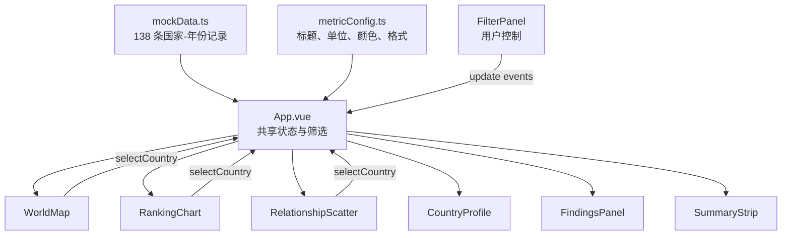
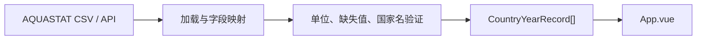

# Dashboard Architecture

本文面向刚接触 Vue 的团队成员，说明当前原型的组件关系、共享状态、数据流和未来最常修改的文件。

## 1. 总体思路

页面采用“一个状态中心 + 多个展示组件”的结构：



`App.vue` 是状态中心，但不是图表实现文件。每个图表在自己的组件中创建 ECharts option，并通过 props 与 events 和 `App.vue` 沟通。

## 2. 共享状态

`App.vue` 中的六个 `ref` 是整个仪表板的单一事实来源：

| 状态 | 作用 | 默认值 |
| --- | --- | --- |
| `selectedCountry` | 所有视图共同高亮的国家 | Jordan |
| `selectedYear` | 当前年份切片 | 2022 |
| `selectedRegion` | 当前区域范围 | All regions |
| `selectedMetric` | 地图与排名共同指标 | waterStress |
| `selectedXMetric` | 散点图 X 轴 | renewableWaterResources |
| `selectedYMetric` | 散点图 Y 轴 | waterStress |

这些变量使用 Vue `ref()` 创建。修改 `ref` 的 `.value` 后，所有依赖它的 `computed` 和组件 props 会自动更新。

## 3. 数据流

### 3.1 原始数据到视图

1. `mockData.ts` 导出 `mockData`。
2. `yearData` 根据 `selectedYear` 只保留一个年份。
3. `filteredData` 再根据 `selectedRegion` 缩小范围。
4. `WorldMap`、`RankingChart`、`RelationshipScatter`、`SummaryStrip` 和 `FindingsPanel` 接收 `filteredData`。
5. `CountryProfile` 也接收 `filteredData`，因此它显示的排名和区域筛选范围一致。

这两个 `computed` 是纯派生值，不应该手动修改：

```ts
const yearData = computed(() => /* 按年份筛选 */)
const filteredData = computed(() => /* 再按区域筛选 */)
```

### 3.2 组件到状态

子组件不能直接修改 `App.vue` 的变量。它们使用事件表达用户意图：

```text
用户点击国家
  -> 子组件 emit('selectCountry', country)
  -> App.vue 的 selectCountry(country)
  -> selectedCountry 更新
  -> 所有相关组件重新计算
```

年份、区域和指标采用 `update:属性名` 事件，和 Vue 的 `v-model` 机制相同。

## 4. 图表交互流

### 地图

`WorldMap.vue` 在挂载后加载 `public/data/world.json`，通过 `echarts.registerMap` 注册世界地图。组件将当前筛选数据转换为 `{ name, value, selected }`，国家名称必须与 GeoJSON 名称一致。

点击有数据的国家后，组件发出 `selectCountry`。灰色国家没有模拟记录，不改变选择。

### 排名

`RankingChart.vue` 根据 `selectedMetric` 对当前范围降序排列，显示前 10 名。如果当前选中国家不在前 10，会额外加入一行，保证选择状态仍可见。

点击横条使用国家名发送 `selectCountry`。

### 散点图

`RelationshipScatter.vue` 使用 `selectedXMetric` 与 `selectedYMetric` 决定坐标轴。国家按区域分组并着色，气泡大小由人口决定。数值跨度超过 100 倍时自动使用对数轴。

选中国家使用独立的金色描边系列覆盖在其他点上。点击点后通过数据项的国家名发送 `selectCountry`。

### 国家画像

`CountryProfile.vue` 找到 `selectedCountry` 对应记录，计算：

- 当前主指标在筛选范围内的排名；
- 农业、工业、城市用水构成；
- 水压力、用水效率和人均资源与区域平均的比较。

### 发现工作台

`FindingsPanel.vue` 目前生成三个临时观察：

- 当前国家相对筛选均值的差异；
- 当前国家在所属区域的排名；
- 基于标准差的演示离群点提示。

这只是 UI 占位逻辑，真实研究阶段必须由可靠分析替换。

## 5. 指标配置

`metricConfig.ts` 让所有组件共享相同显示规则：

```ts
interface MetricDefinition {
  key: MetricKey
  label: string
  shortLabel: string
  unit: string
  decimals: number
  description: string
  palette: string[]
}
```

如果只想改单位、标题、小数位或颜色，应先修改这里，而不是逐个搜索组件。

## 6. 重要文件与常见修改

| 需求 | 首选文件 |
| --- | --- |
| 替换真实数据 | `src/mockData.ts`，必要时新增 data loader |
| 修改数据字段 | `src/types.ts` |
| 改指标名称、单位、格式或颜色 | `src/metricConfig.ts` |
| 改全局页面布局 | `src/App.vue`、`src/styles.css` |
| 改筛选器 | `src/components/FilterPanel.vue` |
| 改世界地图 | `src/components/WorldMap.vue` |
| 改排名 | `src/components/RankingChart.vue` |
| 改散点关系 | `src/components/RelationshipScatter.vue` |
| 改国家详情 | `src/components/CountryProfile.vue` |
| 写入最终洞察 | `src/components/FindingsPanel.vue` |

## 7. 后续接入真实数据时的建议边界

推荐新增 `src/data/` 和 `src/composables/useAquastatData.ts`，让加载、清洗和字段映射与视图组件分离：



不要让地图组件自己请求和清洗 AQUASTAT 数据；地图应该只负责把已整理的记录画出来。

## 8. 响应式布局

- 宽屏：地图与国家画像并排，排名与散点并排。
- 1150px 以下：主要分析面板改为单列。
- 760px 以下：筛选器重新排版，控件扩大到适合触摸的宽度。
- 540px 以下：摘要卡保持两列，避免极窄的小卡片。

响应式规则主要位于 `src/styles.css` 和各组件底部的 scoped media queries。

## 9. 不应误改的材料

以下文件是课程约束或设计参考，不属于运行代码：

- `Project2要求.pdf`
- `Previous Project/`
- `Reference.md`

它们应保持原样。需要补充自己的分析说明时，请新建文档，不要覆盖这些材料。
